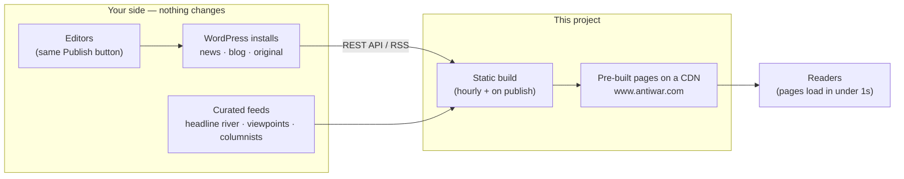

# Making This the Real Antiwar.com

A step-by-step guide for the Antiwar.com team: everything needed to take this redesign live, and — just as important — everything that **doesn't change**.

The short version: your editors keep posting to WordPress exactly as they do today. This site reads your existing feeds and APIs and republishes them as fast static pages. Switching over is a hosting/DNS change plus a two-line config edit, not a content migration.

## Not technical? Read this bit and skip the rest

Nobody on your team needs to touch code to make this happen. Pick whichever of these suits you:

1. **We do it with you.** Reply to the email that brought you here, or [open a "Help me go live" issue](../../issues/new?template=go-live-help.yml) and answer a few plain questions. We'll handle every technical step in this guide — you approve, we type.
2. **Hand this page to any developer.** It's self-contained; a competent dev can complete it in an afternoon.
3. **Hand this page to an AI assistant.** This guide is written step-by-step on purpose: paste it into an AI coding tool (Claude, ChatGPT, Cursor, and similar) and it can do the work — edit the config, remove the demo notices, set up hosting — while you watch and approve. **If you'd like, we'll supply the AI access and credits for this, free.** Just ask in the email thread or an issue.

The rest of this document is the full detail, mostly for whoever (or whatever) does the typing.

## How it fits together



Everything on the left stays exactly where it is and keeps working the way it does today. The build reads from it; readers never touch it. That also means your WordPress servers stop taking public traffic, which makes them cheaper to run and irrelevant to traffic spikes.

## What doesn't change (nothing to migrate)

- **Editorial workflow** — News and Blog posts keep going into WordPress at `news.antiwar.com` and `www.antiwar.com/blog`; Opinion keeps publishing to `original.antiwar.com`. The site pulls from your existing WordPress REST APIs and RSS feeds at build time. No new CMS, no retraining, no content export/import.
- **The headline river and viewpoints** — pulled from the same curated feeds you maintain now.
- **Columnists** — read from your existing columnists JSON (top/bottom/former tiers map to featured/regular/former).
- **Donations** — the donate page links to your existing donation processor. No payment infrastructure moves.
- **Newsletter** — the signup form posts to your existing Lyris/NetAtlantic list server (`pr3.netatlantic.com`) with the same field set as your current form.
- **Ads** — direct-sold ads render exactly like today (creative + "Advertise on Antiwar.com" link). See [Managing ads](README.md#managing-ads).
- **Deep archive** — pre-redesign article URLs on your existing servers keep working; this site links to them where needed.

If you stop liking the redesign, turn it off and the old site is still there. Nothing is destroyed by trying it.

## The switch, step by step

### 1. Take ownership of the code

Either fork this repository into your own GitHub account/organization, or ask and we'll transfer it outright. The code is MIT-licensed — it's yours, no strings.

### 2 & 3. Run the go-live script (or do it by hand)

One command does steps 2 and 3 for you — points the config at your domain and strips every demo notice:

```sh
bun run scripts/go-live.ts
```

It edits the files locally and prints what it changed; review with `git diff` and commit. (Use `--domain https://staging.antiwar.com` first if you want a staging pass.)

Prefer to do it by hand? It's small:

**Step 2 — point the config at your domain (two lines).** In `astro.config.mjs`, change:

```js
site: 'https://kpd-leaf.github.io',   →   site: 'https://www.antiwar.com',
base: '/antiwar-redesign',            →   base: '/',
```

That's the whole config change. Every internal link in the site goes through a `withBase()` helper, so nothing else needs touching — sitemaps, canonical URLs, Open Graph tags, and search all follow automatically.

**Step 3 — remove the demo notices (three spots).** These exist only because this is an unofficial concept:

| What | Where |
| --- | --- |
| Banner: "Unofficial redesign concept…" | `src/components/Masthead.astro` — delete the `<div class="notice">` block (and its styles) |
| Footer note: "Unofficial redesign concept…" | `src/components/SiteFooter.astro` — delete the `.footer-demo-note` paragraph (and its styles) |
| The pitch page itself | delete `src/pages/about-this-redesign.astro` |

### 4. Choose hosting

It's a plain static site — after a build, `dist/` is just HTML/CSS files. Any of these work:

- **GitHub Pages (zero extra cost, current setup).** The included workflow (`.github/workflows/deploy.yml`) already builds, deploys, and **rebuilds hourly** so new WordPress posts appear on the site automatically. Enable Pages ("GitHub Actions" as source) in your fork, add `www.antiwar.com` as the custom domain, done.
- **Netlify / Cloudflare Pages / Vercel** — connect the repo, set the build command to `bun run build` (or `npm run build` with Node 20+), publish directory `dist/`. Add a scheduled rebuild hook to match the hourly refresh.
- **Your own server** — run the build on any machine on a cron and rsync `dist/` up.

Content freshness = rebuild frequency. Hourly is the default cron; tighten it to every 15 minutes by editing one line in the workflow — or skip the wait entirely with instant publishing, below.

### 4b. Instant publishing (publish → live in ~2–3 minutes)

For breaking news, hourly isn't good enough. The workflow already listens for an external trigger (`repository_dispatch`), so WordPress can kick off a rebuild the moment an editor hits **Publish**:

1. **Create a GitHub token** — a fine-grained personal access token scoped to this one repo with "Contents: read and write" permission (that's the scope `repository_dispatch` needs).
2. **Make WordPress call it on publish.** Two options:
   - **Our plugin (recommended, no code):** this repo ships a ready-made WordPress plugin — [`integrations/antiwar-instant-publish`](integrations/README.md). Upload it via **Plugins → Add New → Upload Plugin**, activate, paste the repo name and token under **Settings → Instant Publish**, and click "Send Test Rebuild" to confirm. No theme editing, survives theme updates.
   - **Snippet (~10 lines):** if you'd rather not install a plugin, add this to the theme's `functions.php` on the `news` and `blog` WordPress installs:

     ```php
     add_action('transition_post_status', function ($new, $old, $post) {
         if ($new !== 'publish' || $old === 'publish') return;
         wp_remote_post('https://api.github.com/repos/YOUR-ORG/YOUR-REPO/dispatches', [
             'headers' => [
                 'Authorization' => 'Bearer YOUR-TOKEN',
                 'Accept'        => 'application/vnd.github+json',
             ],
             'body' => wp_json_encode(['event_type' => 'publish']),
         ]);
     }, 10, 3);
     ```

3. That's it. Publish → webhook fires → site rebuilds and deploys, typically live in ~2–3 minutes. The hourly cron stays on as a safety net, and Opinion pieces (RSS from `original.antiwar.com`) get picked up by it too — or wire the same webhook there for instant turnaround across the board.

Editors change nothing about how they work: same WordPress, same Publish button. If you're hosting on Netlify/Cloudflare Pages instead of GitHub Pages, the equivalent is a build hook URL — same idea, one POST on publish. Happy to set any of this up with you.

### 5. Cut over DNS

When you're happy with a staging deploy, point `www.antiwar.com` at the new host. Because the site is static and pre-built, there's no warm-up, no database migration window, and rollback is just pointing DNS back.

Keep `news.antiwar.com`, `original.antiwar.com`, and the WordPress installs exactly where they are — the build depends on them.

### 6. Pre-launch checklist

- [ ] `site`/`base` changed in `astro.config.mjs` (step 2)
- [ ] Demo notices removed (step 3)
- [ ] One **real newsletter test submission** from the deployed `/newsletter` page to confirm your list server accepts it end-to-end
- [ ] Current ads entered in `src/data/ads.json` (see [Managing ads](README.md#managing-ads))
- [ ] Analytics, if you use any: add the snippet once in `src/layouts/BaseLayout.astro` and it's on every page
- [ ] Redirects for any legacy URL patterns you want preserved (host-dependent; happy to help map these)
- [ ] Verify `https://www.antiwar.com/sitemap-index.xml` and submit to Google Search Console so search engines pick up the faster pages

## Day-two operations

| Task | How |
| --- | --- |
| Publish an article | Post to WordPress like always — live in ~2–3 min with [instant publishing](#4b-instant-publishing-publish--live-in-23-minutes), or on the next scheduled rebuild |
| Run / pull an ad | Edit `src/data/ads.json` ([details](README.md#managing-ads)) |
| Hand-pick the Top Story | Set `LEAD_SLUG` at the top of `src/pages/index.astro` |
| Change colors / fonts / spacing | Edit tokens in `src/styles/tokens.css` |
| Add a section or feed | One loader in `src/lib/loaders.ts` + one page under `src/pages/` |
| Feed outage | Nothing to do — the build falls back to the last good snapshot and the site stays up |

## Questions

Open a GitHub issue on this repository (there's a ["Help me go live" template](../../issues/new?template=go-live-help.yml)), or reply to the email that brought you here. Happy to walk anyone on your team through any part of this, help with the DNS cutover, or make changes you'd want before going live.

And if your team would rather work with an AI assistant on any of the integration — from the two-line config change to the WordPress webhook — say the word and we'll set you up with access and credits, free.
